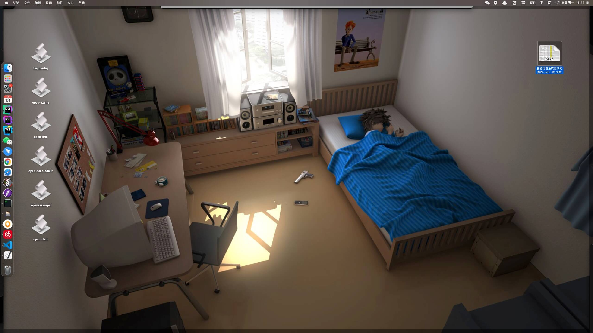

# my-applescript

我常用的 AppleScript

## 目录

1. `happy-day.scpt`: 每天开机后运行, 功能:
   - 依次打开: Chrome、微信、钉钉、网易云音乐、Quiver、Clearview
2. `open-shzb.scpt`: 初始化 shzb 工作空间 (个人项目)
   - 在 iTerm 中打开工程
   - 在 Webstrom 中打开工程
   - 更新代码
   - 执行开发脚本: `npm run dev`
   - 在 Chrome 中打开 `http://localhost:8000`
3. `open-et.scpt`: 初始化 EasyTraining 工作空间 (个人项目)
4. `open-12345.scpt`: 初始化 12345 工作空间 (个人项目)
5. `open-crm.scpt`: 初始化 CRM 工作空间 (公司项目)
6. `open-saas-pc.scpt`: 初始计 Saas 租户端工作空间 (公司项目)
7. `open-saas-admin.scpt`: 初始计 Saas 管理端工作空间 (公司项目)

## 如何使用

1. 将 `.scpt` 文件用 MacOS 的 `Script Editor` 打开
2. 导出为应用程序, 勾选 "仅运行"
3. 导出到桌面, 后续就可以双击一下, 直接初始化工作空间了

## 其他说明

1. 由于 `.scpt` 文件无法直接打开, 故留存 `.txt` 文件为源码
2. 以上脚本不涉及到私密信息
